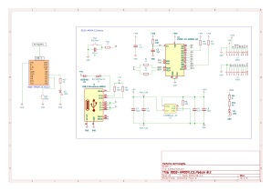

# esp32-rpi-ble-example

* ESP32-C3(ベリフェラル)とRaspberry Pi4(セントラル)を使ったBLE送受信のサンプル
* ベリフェラル側のボタンを押すとカウントアップされ、セントラル側にNotifyで通知される。
* セントラル側はWriteでベリフェラル側に数値が送られる。0x00でなければLEDが点灯する。

# 環境

## ESP32-C3(自作モジュール)

[ソース](./esp32-c3)

* ベリフェラル
* ESP32-C3(RISC-V)を使用した自作モジュール
* Arduino(C++),Arduino-CLI

回路図

[PDF](./resource/schematics/board.pdf)

## Raspberry Pi 4

[ソース](./central)

* セントラル
* Raspberry Pi OS Lite(64Bit)
* Golang, tinygo bluetooth
* Linux専用

tinygo-bluetoothはクラスプラットフォームだが、macOSの場合はWriteWithoutResponseが正常に動作しなかった。

# TIPS

* macOSでUUIDを生成する場合はuuidgenを使うとよい

## Raspberry Pi OS上にarduino-cliを導入する

    $ cd
    $ curl -fsSL https://raw.githubusercontent.com/arduino/arduino-cli/master/install.sh | sh
    $ echo 'export PATH=$HOME/bin:$PATH' >> $HOME/.bashrc
    $ exec $SHELL
    $ arduino-cli config init

    $ sh -xe << 'EOS'
    arduino-cli config add board_manager.additional_urls 'https://arduino.esp8266.com/stable/package_esp8266com_index.json'
    arduino-cli config add board_manager.additional_urls 'https://espressif.github.io/arduino-esp32/package_esp32_index.json'
    arduino-cli core install esp8266:esp8266
    arduino-cli core install esp32:esp32
    arduino-cli board list
    arduino-cli board listall
    EOS

    $ sudo apt install python3-serial
